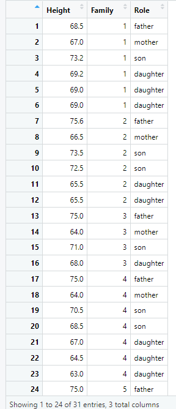
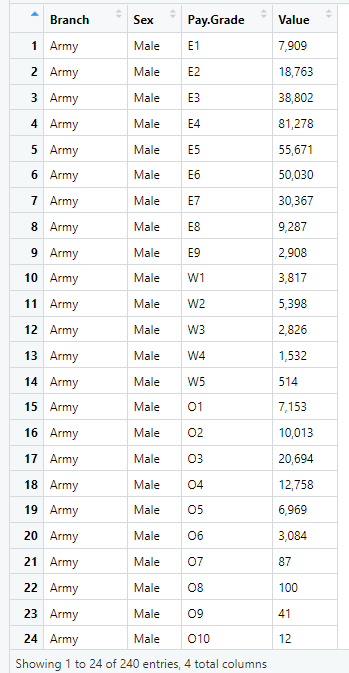

# Introduction
This repository contains the code and data files used to complete Activity 04 - Tidying Data for the course STAT 184. The activity assignment required using the R programming language to load and view two different data sets and evaluate whether their organizational structures could be considered "tidy." The two data sets are a table of family member heights from scientist Francis Galton's notebooks on family height relationships and a table of data on the US Armed Forces service branches, organized by branch, soldier gender, pay grade, and amount of soldiers.

# Implementation
In this assignment, I used the read.csv() function in R to read the data sets from their respective file paths. I then saved the functions' output tables to respective variables for each table. Lastly, I displayed each table using the View() function. An example of the syntax used to create a view of the Galton family data is shown below:
```
galton_tidy_df <- read.csv("C:/Users/jason/OneDrive - The Pennsylvania State University/FA 24-25 Classes/STAT 184/Activities/galton_tidy_table.csv")

View(galton_tidy_df)
```
# Results
After using the syntax above and similar code to display the two data sets, I completed the assignment by evaluating whether or not each data set could be considered "tidy." Portions of each data set from the View() function calls are shown below:



From these table views, I concluded that neither table is "tidy." The Galton family table is not "tidy" since it does not describe one "case" per row (where each "case" is an individual family member) and does not adjust for the "height" values in inches being the shown value plus 60 inches, which is a note included in Galton's original notebook yet omitted from this table. Similarly, the armed forces table is not "tidy" since it does not adequately represent the "case" of a group of soldiers per row.

These findings have helped improve my understanding of what constitutes a "tidy" data set and the changes that would be required to improve the organization of an "non-tidy" table. This development will allow me to identify necessary changes to future data sets I work with to improve their organization and ability to be manipulated: the primary benefits of "tidy" data.

# Contact
Thank you for visiting this repository. Please send any inquiries to [jsf5479@psu.edu](mailto:jsf5479@psu.edu).
